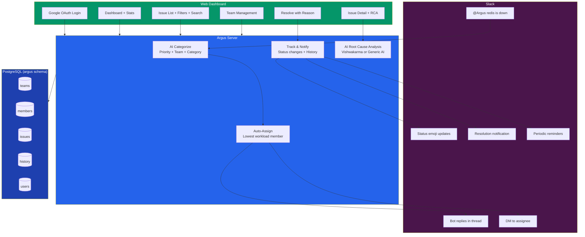
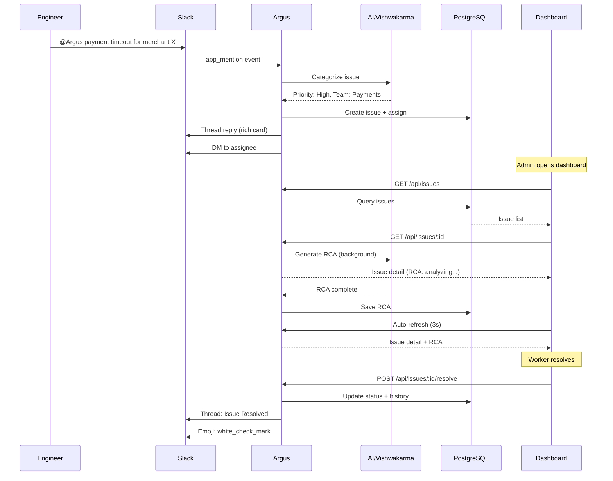

<div align="center">

# Argus

**The All-Seeing Production Issue Tracker**

[](https://python.org)
[](https://fastapi.tiangolo.com)
[](https://react.dev)
[](https://typescriptlang.org)
[](https://api.slack.com)
[](https://postgresql.org)

*Tag @Argus in Slack. AI categorizes, assigns, and tracks. Your team resolves. Everyone stays in the loop.*

</div>

---

## How It Works





## The Flow

### 1. Report via Slack
```
Engineer:  @Argus payment gateway timeout for merchant X
Argus:     New Issue Tracked
           Priority: High | Team: Payments | Assigned: @priya
           View in Dashboard
```

### 2. AI Categorizes & Assigns
- AI analyzes the message, determines priority/category/team
- Auto-assigns to the team member with the lowest workload
- Everyone gets notified — thread reply + DM to assignee

### 3. Track on Dashboard
- Filter by status, priority, team, or "My Issues"
- AI-powered Root Cause Analysis (via Vishwakarma in production)
- Full audit trail — who changed what, when

### 4. Resolve & Close
- Resolve requires a reason: "How was this fixed?"
- Close requires a reason: "Why are you closing this?"
- Slack thread gets updated, emojis swap, everyone knows

---

## Features

### Slack Integration
- **@Argus** mention creates issues automatically
- Rich Slack attachments with colored priority bars
- Status change / reassign / resolve notifications in thread
- DM to all assignees on assignment
- Reminders for stale issues (configurable per team)
- Thread-only — mentions in existing threads are redirected

### AI-Powered
- **Issue Categorization** — priority, category, team assignment
- **Root Cause Analysis** — deep investigation via Vishwakarma (production) or generic AI (local)
- **Live Progress** — streaming SSE shows investigation steps in real-time
- **Automatic Fallback** — Vishwakarma fails? Falls back to generic AI. AI fails? Shows manual investigation steps.

### Role-Based Access
| | Admin | Leader | Worker | Reader |
|---|:---:|:---:|:---:|:---:|
| View dashboard & issues | Yes | Yes | Yes | Yes |
| Create issues | Yes | Yes | Yes | - |
| Change status | Yes | Own team | Own issues | - |
| Resolve (with reason) | Yes | Own team | Own issues | - |
| Close (with reason) | Yes | Own team | - | - |
| Reassign / Change team | Yes | Own team | - | - |
| Manage team members | Yes | Own team | - | - |
| Create / Delete teams | Yes | - | - | - |

### Dashboard
- Stats overview (total, open, in-progress, resolved, critical)
- Per-team progress bars (open vs resolved ratio)
- Recent issues with quick access
- Activity feed — latest changes across all issues
- Quick action links (All Issues, Critical, My Issues)

### Multi-Assign
- Assign multiple people to one issue
- Searchable dropdown across all teams
- Everyone assigned gets a DM
- All assignees tracked in history

---

## Architecture

```
issue-dashboard/
+-- backend/                    Python + FastAPI
|   +-- app/
|   |   +-- api/                REST endpoints (issues, teams, members, auth, dashboard)
|   |   +-- services/           Business logic (AI, assignment, reminders, Slack)
|   |   +-- slack_bot/          Slack Bolt handlers + message formatters
|   |   +-- models/             SQLAlchemy models (5 tables in argus schema)
|   |   +-- schemas/            Pydantic request/response schemas
|   |   +-- auth.py             JWT + Google OAuth
|   |   +-- config.py           All settings from env vars
|   |   +-- database.py         Async SQLAlchemy + schema isolation
|   |   +-- main.py             FastAPI app + static file serving
|   +-- migrations/             Production SQL schema
|   +-- requirements.txt
|
+-- frontend/                   React + TypeScript + Vite
|   +-- src/
|   |   +-- pages/              Dashboard, Issues, IssueDetail, Teams, Login
|   |   +-- components/         IssueDetail, TeamManager, Dashboard, Layout, Avatar
|   |   +-- contexts/           AuthContext (Google OAuth + role checks)
|   |   +-- api/                Typed API client + types
|   +-- index.html
|
+-- k8s/                        Template K8s manifests
+-- prodk8s/                    Production K8s manifests
+-- Dockerfile                  Multi-stage (Node build + Python runtime)
+-- docker-compose.yml          Local dev (PostgreSQL)
```

### Database

Uses a dedicated `argus` schema within a shared PostgreSQL RDS — fully isolated from other services via `search_path`.

```sql
argus.teams          -- Teams with reminder settings
argus.team_members   -- Members with roles (leader/worker), workload counters
argus.issues         -- Issues with AI categorization, multi-assign, Slack metadata
argus.issue_history  -- Full audit trail
argus.users          -- Auth records (Google OAuth)
```

### Key Design Decisions
- **Schema isolation** — `search_path=argus` per connection, zero risk to other DB tables
- **Small connection pool** — 3+5 connections, won't starve shared RDS
- **3-phase reminders** — read fast, send Slack (no DB), write fast. No long transactions.
- **Background RCA** — AI runs in `asyncio.create_task`, doesn't block API responses
- **Single container** — FastAPI serves both API and frontend static files. One pod, one port.

---

## Quick Start (Local)

```bash
# 1. Clone
git clone <repo> && cd issue-dashboard

# 2. PostgreSQL
docker-compose up db -d
psql -U postgres -c "CREATE DATABASE issue_dashboard;"

# 3. Backend
cd backend
python3 -m venv .venv && source .venv/bin/activate
pip install -r requirements.txt
cp .env.example .env  # Edit with your keys
alembic upgrade head  # Or run migrations/001_production_schema.sql
uvicorn app.main:app --reload --port 8000

# 4. Frontend
cd ../frontend
npm install
npm run dev

# 5. Open http://localhost:5173
```

### Environment Variables

| Variable | Required | Description |
|---|---|---|
| `DATABASE_URL` | Yes | PostgreSQL connection string |
| `DB_SCHEMA` | No | Schema name (default: `argus`) |
| `SLACK_BOT_TOKEN` | For Slack | Bot user OAuth token (`xoxb-...`) |
| `SLACK_APP_TOKEN` | For Slack | App-level token for Socket Mode (`xapp-...`) |
| `SLACK_SIGNING_SECRET` | For Slack | Request signing secret |
| `AI_API_KEY` | For AI | LLM API key |
| `AI_API_BASE` | For AI | LLM endpoint URL |
| `AI_MODEL` | No | Model name (default: `openai/open-large`) |
| `AI_FAST_MODEL` | No | Fast model for categorization |
| `AI_MAX_TOKENS` | No | Max tokens (default: 16000) |
| `GOOGLE_CLIENT_ID` | For auth | Google OAuth client ID |
| `GOOGLE_CLIENT_SECRET` | For auth | Google OAuth client secret |
| `GOOGLE_REDIRECT_URI` | For auth | OAuth callback URL |
| `ADMIN_EMAILS` | No | Comma-separated admin emails |
| `ALLOWED_EMAIL_DOMAIN` | No | Restrict login to domain (e.g., `nammayatri.in`) |
| `JWT_SECRET` | Yes | Random secret for JWT signing |
| `VISHWAKARMA_URL` | For prod RCA | Vishwakarma service URL |
| `VISHWAKARMA_TIMEOUT` | No | Investigation timeout seconds (default: 600) |

---

## Production Deployment

Single-container pod on EKS:

```bash
# Build
docker build --platform linux/amd64 -t <ecr>/argus:1.0.0 .
docker push <ecr>/argus:1.0.0

# Deploy
kubectl apply -f prodk8s/deployment.yaml

# Run schema migration (first time only)
psql -U postgres -d <db> -f backend/migrations/001_production_schema.sql
```

### Slack App Setup
1. Create app at [api.slack.com/apps](https://api.slack.com/apps) with manifest:
   - Socket Mode enabled, Token Rotation disabled
   - Bot scopes: `app_mentions:read`, `chat:write`, `reactions:write`, `users:read`, `im:write`, `channels:read`
   - Event subscription: `app_mention`
2. Install to workspace
3. Set `SLACK_BOT_TOKEN`, `SLACK_APP_TOKEN`, `SLACK_SIGNING_SECRET` in K8s secrets

### Google OAuth Setup
1. Create OAuth 2.0 Client at [Google Cloud Console](https://console.cloud.google.com/apis/credentials)
2. Set redirect URI to `https://your-domain/auth/callback`
3. Set `GOOGLE_CLIENT_ID`, `GOOGLE_CLIENT_SECRET`, `GOOGLE_REDIRECT_URI`

---

## API Endpoints

| Method | Path | Auth | Description |
|---|---|---|---|
| `POST` | `/api/auth/google/url` | - | Get Google OAuth URL |
| `POST` | `/api/auth/google/callback` | - | Exchange code for JWT |
| `GET` | `/api/auth/me` | JWT | Current user info |
| `GET` | `/api/issues` | JWT | List issues (filterable, paginated, searchable) |
| `POST` | `/api/issues` | JWT | Create issue |
| `GET` | `/api/issues/:id` | JWT | Issue detail (triggers RCA) |
| `PATCH` | `/api/issues/:id` | JWT | Update issue |
| `POST` | `/api/issues/:id/resolve` | JWT | Resolve with reason |
| `GET` | `/api/issues/:id/history` | JWT | Audit trail |
| `GET` | `/api/teams` | JWT | List teams |
| `POST` | `/api/teams` | Admin | Create team |
| `PATCH` | `/api/teams/:id` | Admin/Leader | Update team |
| `DELETE` | `/api/teams/:id` | Admin | Delete team |
| `GET` | `/api/teams/:id/members` | JWT | List members |
| `POST` | `/api/teams/:id/members` | Admin/Leader | Add member |
| `GET` | `/api/members/assignable` | JWT | All active workers |
| `PATCH` | `/api/members/:id` | Admin/Leader | Update member |
| `DELETE` | `/api/members/:id` | Admin/Leader | Remove member |
| `GET` | `/api/dashboard/stats` | JWT | Dashboard statistics |
| `GET` | `/api/dashboard/team-stats` | JWT | Per-team stats |
| `GET` | `/api/dashboard/recent-activity` | JWT | Latest activity |
| `GET` | `/api/health` | - | Health check (verifies DB) |

---

<div align="center">

*Built for NammaYatri*

</div>
